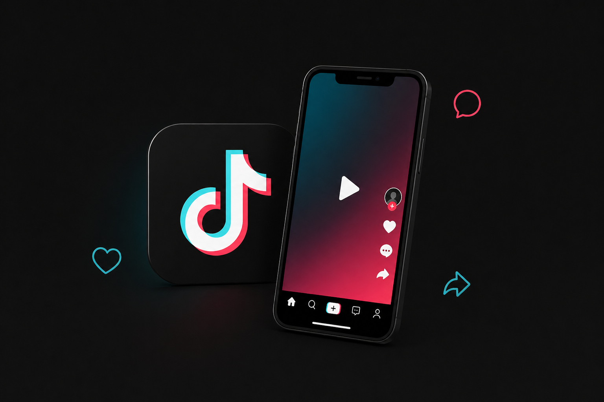
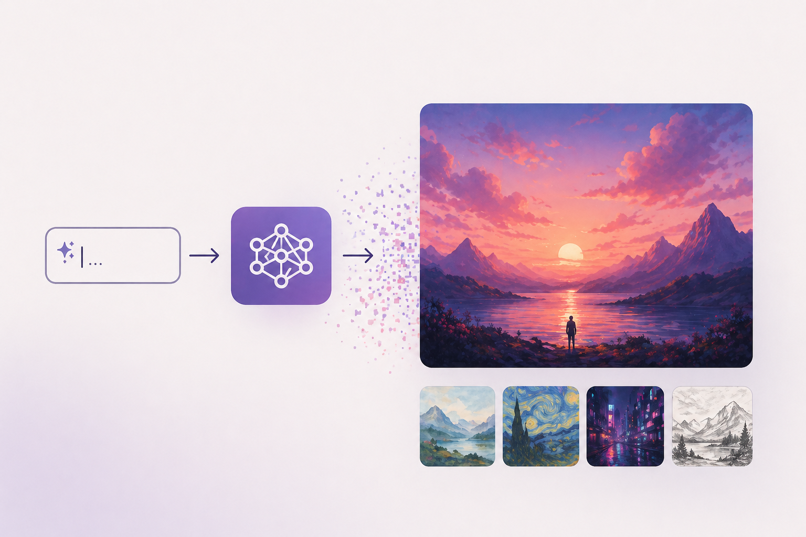

# PEC 3 - El software como metamedio: hibridación y transformación cultural en TikTok y la IA generativa

### Recurso de aprendizaje de Cultura Digital 

Autor: Raúl Montoro Abaijón

Fecha: 

## Casos de hibridación analizados

  

> *La siguiente imagen sintetiza los principales casos de hibridación estudiados en el presente ensayo, mostrando cómo distintos medios tradicionales se combinan en plataformas digitales actuales. Fuente: Imagen generada mediante inteligencia artificial (DALL·E, OpenAI).*

## Introducción

En el contexto de la cultura digital actual, el concepto de hibridación adquiere un papel fundamental para comprender la evolución de los medios bajo la lógica del software. Tal como plantea **Lev Manovich (2013)**, los nuevos medios no se limitan a digitalizar los formatos anteriores, ya que estos son reconfigurados mediante procesos computacionales que permiten su combinación, transformación y expansión funcional. En este sentido, el autor señala que “todas las maneras de acceder, distribuir, analizar y procesar los medios proceden del software” **(Manovich, 2013)**, situando así el software como elemento central en la transformación cultural contemporánea.

Desde esta perspectiva, la hibridación va más allá de la simple coexistencia de múltiples formatos en un mismo entorno -propia del multimedia- para implicar su integración e interacción dentro de estructuras compartidas. Este proceso da lugar a nuevas formas culturales y experiencias mediáticas más complejas. El software actúa como un metamedio que no solo simula medios previos, además los reorganiza mediante algoritmos y estructuras de datos,lo que permite la aparición de nuevas prácticas culturales.

Además de esta dimensión técnica y estructural, este proceso se ve reforzado por las dinámicas propias de la cultura digital, como el *crowdsourcing* y la producción colectiva, cuyos usuarios participan activamente en la generación y transformación de contenidos. En este contexto, las plataformas digitales basadas en inteligencia artificial no se limitan únicamente a distribuir información, además, articulan sistemas híbridos en los que convergen medios, datos y prácticas sociales.

En el presente ensayo, se analizan dos casos contemporáneos que evidencian esta transformación: la plataforma **TikTok** y las **herramientas de generación de imágenes** mediante inteligencia artificial como DALL·E o MindJourney. El objetivo no es únicamente describir estos entornos digitales, sino analizarlos desde el punto de vista de **Lev Manovich**, entendiendo la hibridación como un proceso en el que el software no solo integra medios, sino que transforma sus lógicas culturales y sus formas de uso.

## TikTok como sistema híbrido: algoritmos, modularidad y cultura participativa

  

> *Figura 1: La siguiente imagen representa la interfaz de TikTok como espacio de convergencia entre distintos medios y lógicas culturales. Fuente: Imagen generada mediante inteligencia artificial (DALL·E, OpenAI), utilizada como recurso visual para representar la hibridación de medios en entornos digitales.*

La plataforma TikTok se ha consolidado como uno de los entornos más representativos de la cultura digital actual. Aunque superficialmente puede entenderse como una red social cuyo objetivo es la difusión de vídeos cortos, su funcionamiento revela un sistema mucho más complejo en el que convergen múltiples medios, tecnologías y prácticas culturales en un entorno altamente mediado por el software.

Desde el punto de vista de la hibridación, TikTok no se limita a la simple integración de formatos como vídeo, audio o texto dentro de una misma interfaz. Estos elementos se articulan en una estructura interactiva compartida, donde se combinan, evolucionan y adquieren nuevas funciones según su contexto de uso. La lógica del software permite una fusión de sus características, configurando un sistema en el que el vídeo, el sonido y la interacción del usuario se transforman y adquieren nuevas funciones dentro de un entorno algorítmico.

El vídeo deja de ser una unidad cerrada y pasa a entenderse como un objeto modular, susceptible de ser reutilizado, reinterpretado y recombinado de forma constante. Esta lógica se relaciona directamente con los principios de los nuevos medios aportados por **Manovich (2013)**, en concreto la modularidad y la automatización. Los contenidos se estructuran en unidades independientes (clips, sonidos, efectos) que pueden ensamblarse dinámicamente según distintas combinaciones.

Al mismo tiempo, el algoritmo de recomendación de contenidos actúa como un elemento estructurador que selecciona, jerarquiza y distribuye los contenidos. De este modo, funciones tradicionalmente asociadas a la edición audiovisual, como el montaje, pasan a ser gestionadas por software. En consecuencia,el sistema no solo media la experiencia del usuario, también interviene de manera activa en la producción de significado.

Consecuentemente, esta transformación pone de manifiesto lo que **Manovich** describe como hibridación de medios, entendida como la integración de técnicas y lógicas previamente separadas en un mismo sistema. En sus palabras, *“en los híbridos de medios, las interfaces, técnicas y tradiciones de distintos medios se combinan en nuevas formas”* **(Manovich, 2013)**. En el caso de TikTok, esta combinación se materializa en la fusión entre edición audiovisual, interacción social y sistemas algorítmicos de recomendación.

En este contexto, el _feed_ personalizado se interpreta como una estructura de datos de carácter dinámico que se reconfigura continuamente a partir de la interacción del usuario. A diferencia de los medios tradicionales, donde el montaje responde a una decisión autoral, en TikTok esta función se delega en el sistema algorítmico, capaz de construir narrativas personalizadas en tiempo real.

En paralelo, la plataforma ejemplifica de forma clara las dinámicas de producción colectiva propias de la cultura digital. A través de prácticas como los "_trends_", los usuarios participan en la reinterpretación y expansión de los contenidos, generando múltiples variaciones a partir de una misma base. Este fenómeno se relaciona con el concepto de _crowdsourcing_, en el que la creatividad emerge de la contribución distribuida de la comunidad. Cada usuario aporta nuevas capas de significado dentro de un sistema que evoluciona de manera constante a partir de la interacción colectiva.

En conjunto, TikTok constituye un ejemplo paradigmático de hibridación contemporánea. La integración de medios, algoritmos y participación social configura una experiencia mediática caracterizada por la personalización, la interacción constante y la reconfiguración continua del contenido. Se trata de un entorno en el que el software redefine la creación, distribución y consumo de los medios.

## La IA generativa: fusión entre lenguaje, imagen y algoritmo en la creación visual

  

> *La siguiente imagen representa el proceso de generación de imágenes mediante inteligencia artificial, donde la interacción entre el usuario y el sistema algorítmico permite transformar instrucciones textuales en representaciones visuales, evidenciando la hibridación entre lenguaje, datos y creatividad computacional. Fuente: Imagen generada mediante inteligencia artificial (DALL·E, OpenAI), utilizada como recurso visual para representar procesos de creación mediada por software.*

Las herramientas de generación de imágenes mediante inteligencia artificial, como lo son Midjouney o DALL·E, representan uno de los ejemplos más significativos de hibridación cultural de nuestros días. Estos sistemas permiten la creación de imágenes a partir de *prompts* (descripciones en lenguaje natural), situando el proceso creativo en un plano donde convergen los medios, datos y operaciones computacionales.

En el marco de la hibridación, estas herramientas no se limitan a combinar texto e imagen en una misma interfaz. Su funcionamiento implica una fusión en profundidad de ambos lenguajes, mediada por modelos algorítmicos entrenados con grandes volúmenes de datos visuales y textuales. El resultado no es una simple traducción de un medio a otro; se trata de la generación de una nueva forma de producción visual en la que el lenguaje se convierte en un mecanismo operativo que activa el proceso de creación.

Este fenómeno se fundamenta en los planteamientos de **Lev Manovich**, especialmente en lo relativo al papel que tiene el software como metamedio.  La imagen generada no depende directamente de las habilidades técnicas tradicionales, en cambio, pasa a construirse mediante la interacción con una red neuronal que interpreta, transforma y materializa instrucciones en lenguaje natural.

Por otra parte, estas herramientas se sustentan en grandes conjuntos de datos que funcionan como base para el aprendizaje de los modelos. Una parte significativa de estos datos procede de producciones culturales generadas colectivamente en entornos digitales, lo que añade una dimensión vinculada al *crowdsourcing*. De este modo, la creación individual se apoya en un conocimiento previamente sistematizado y a partir de la contribución colectiva.

La experiencia de uso que nace de esta hibridación transforma de manera significativa la relación entre el usuario y el proceso creativo. El papel que desempeña el creador se desplaza hacia una función más cercana a la dirección o la supervisión, donde la formulación de *prompts* adquiere un papel clave. En lugar de ejecutar directamente la producción visual, el usuario define unas condiciones y unas características, ajusta parámetros y evalúa los resultados dentro de un sistema que genera varios resultados a partir de una misma instrucción.

En conjunto, la generación de imágenes por IA constituye un buen ejemplo de hibridación contemporánea, en el que la fusión entre lenguaje, imagen, datos y algoritmos da lugar a una nueva forma de creación visual. Dicha transformación configura una experiencia mediática claramente diferenciada, caracterizada por la automatización de procesos creativos, la variabilidad en los resultados y la interacción constante usuario-sistema. Más que una herramienta, se presenta como un entorno en el que el software redefine los límites de la autoría, la creatividad y la producción cultural en la era digital.

## Conclusiones

Tras el análisis de los casos de TikTok y las herramientas de IA generativa, se observa cómo la hibridación se consolida como una de las principales dinámicas en la evolución de los medios digitales. En ambos casos, no se produce una simple coexistencia de formatos, en su lugar,  se genera una fusión de técnicas y lenguajes que da lugar a nuevas formas culturales y experiencias mediáticas.

A la luz de los planteamientos propuestos por **Manovich (2013)** , esta transformación se explica por el papel del software como metamedio, capaz de integrar y reconfigurar medios existentes dentro de un mismo entorno computacional. 

Asimismo, ambos casos evidencian cómo la hibridación no solo afecta a los medios en sí, sino también a la experiencia del usuario. En TikTok, esta se caracteriza por la personalización algorítmica y la participación activa en la creación de contenido. En el caso de la IA generativa, el usuario adopta un rol más creativo y estratégico, interactuando con el sistema mediante en lenguaje natural. En ambos escenarios, lo interesante es que, el usuario abandona el papel de receptor pasivo para convertirse en un agente activo durante el proceso.

Por otro lado, la dimensión colectiva resulta fundamental. La producción de contenido en plataformas digitales y los conjuntos de datos que alimentan los modelos de IA, hacen evidente la importancia del *crowdsourcing* como mecanismo de generación y a la vez de organización del conocimiento en la cultura digital.

En este sentido, la hibridación no puede separarse del proceso de transcodificación, ya que la lógica computacional no solo organiza los medios, sino que reconfigura las prácticas culturales asociadas a ellos.

Desde una perspectiva más personal, esta transformación plantea una tensión interesante entre comodidad y dependencia. La automatización y personalización facilitan el acceso y la creación de contenido, sin embargo, al mismo tiempo condicionan nuestras decisiones y formas de interacción con los sistemas. Por lo tanto, la hibridación no solo amplía las posibilidades de los medios, sino que también redefine nuestra relación con ellos, generando nuevas formas de dependencia hacia los sistemas digitales.

En definitiva, la hibridación, entendida como la fusión de técnicas y medios dentro del software, redefine las condiciones de creación, distribución y consumo cultural. Lejos de limitarse a integrar los formatos existentes, estos sistemas se expanden generando nuevas formas de representar el mundo y de interactuar con él, consolidando el papel del software como el elemento central en la configuración de los medios digitales actuales.

Como cierre, la evolución de los medios digitales no puede entenderse sin considerar que, como afirma **Manovich (2013)**, el software se ha convertido en la infraestructura cultural que articula la producción y circulación de contenidos.

## Bibliografía

+ Adell, J. (2024). _Fundamentos y evolución de la multimedia: remediación, multimedia e hibridación de los medios_. UOC.

+ Manovich, L. (2013). _El software toma el mando_. UOC.

+ Gea, M. (2022). _Herramientas y metodología crowdsourcing para la participación y creación colectiva de conocimiento abierto_. GitHub. https://github.com/mgea/CCpapers

+ McMillan, R. (2012). _Lord of the Files: How GitHub tamed free software (and more)_. GitHub. https://github.com/WiredEnterprise/Lord-of-the-Files

----

Licencia: Material Creative Commons desarrollado bajo licencia CC BY-SA 4.0. Imágenes CC BY [Tubik studio](https://blog.tubikstudio.com/how-to-create-original-flat-illustrations-designers-tips/) 
